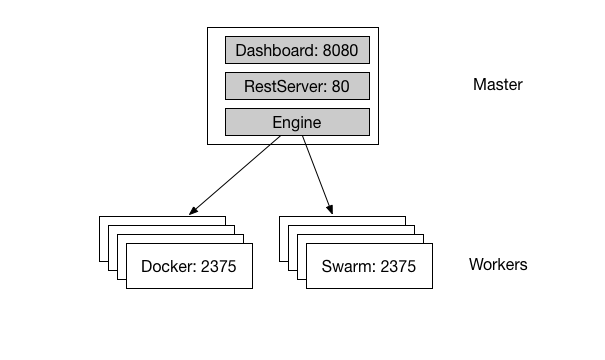

# Deployment

**Hyperledger fabric changes the service port number since 0.6, so if you want to use the legacy 0.5 code, please use the dp-0.5 branch, which will be deprecated soon.**

There are two kinds of nodes, we suggest all nodes are Linux-based (Ubuntu 14.04+) VM/Servers: 

* Master Node: Manage (e.g., create/delete) the chains in Work Nodes, providing dashboard on port `8080` and rest api on port `80`;
* Worker Node: Container providers, can be Docker Host or Swarm Cluster, usually the Docker service should listen on port `2375`.



If it's the first time to setup Cello, we recommend first setup a Docker Host as Worker Node. 

This doc only describe the basic deployment setups, we highly recommend you to read the [Production Configuration](production_config.md) if you adopt Cello for production usage.

## Worker Node
Currently we support Docker Host and Swarm Cluster as Worker Node.

### System Requirement
* Hardware: 8c16g100g
* Docker engine:
    - 1.12.0+
* aufs-tools (optional): Only required on ubuntu 14.04.

### Docker Setup

Let Docker daemon listen on port 2375, and make sure Master can reach Worker Node through this port. 

#### Ubuntu 14.04 
Simple add this line into your Docker config file `/etc/default/docker`.

```sh
DOCKER_OPTS="$DOCKER_OPTS -H tcp://0.0.0.0:2375 -H unix:///var/run/docker.sock --api-cors-header='*' --default-ulimit=nofile=8192:16384 --default-ulimit=nproc=8192:16384"
```

Then restart the docker daemon with:

```sh
$ sudo service docker restart
```

#### Ubuntu 16.04
Update `/etc/systemd/system/docker.service.d/override.conf` like

```
[Service]
DOCKER_OPTS="$DOCKER_OPTS -H tcp://0.0.0.0:2375 -H unix:///var/run/docker.sock --api-cors-header='*' --default-ulimit=nofile=8192:16384 --default-ulimit=nproc=8192:16384"
EnvironmentFile=-/etc/default/docker
ExecStart=
ExecStart=/usr/bin/dockerd -H fd:// $DOCKER_OPTS
```

Regenerate the docker service script and restart the docker engine:
 
```sh
$ sudo systemctl daemon-reload
$ sudo systemctl restart docker.service
```

At last, run the follow test at Master node and get OK response, to make sure it can access Worker node successfully.

```sh
[Master] $ docker -H Worker_Node_IP:2375 version
```

### Docker images
Pulling the following images.

```bash
$ docker pull hyperledger/fabric-peer:x86_64-0.6.1-preview \
  && docker pull hyperledger/fabric-membersrvc:x86_64-0.6.1-preview \
  && docker pull yeasy/blockchain-explorer:latest \
  && docker tag hyperledger/fabric-peer:x86_64-0.6.1-preview hyperledger/fabric-peer \
  && docker tag hyperledger/fabric-peer:x86_64-0.6.1-preview hyperledger/fabric-baseimage \
  && docker tag hyperledger/fabric-membersrvc:x86_64-0.6.1-preview hyperledger/fabric-membersrvc
```

### Firewall Setup
Make sure ip forward is enabled, you can simply run the follow command.

```sh
$ sysctl -w net.ipv4.ip_forward=1
```
And check the os iptables config, to make sure host ports are open (e.g., 2375, 7050~10000)

## Master Node
You may need to install `git` and `make` manually before cloning the code and using the setup scripts. 

### System Requirement
* Hardware: 8c16g100g
* Docker engine: 1.12.0+
* docker-compose: 1.7.0+


### Clone Code

```sh
$ sudo aptitude install git make -y
$ git clone https://github.com/yeasy/cello && cd cello
```

### Docker images

Pull the following images

```bash
$ docker pull python:3.5 \
	&& docker pull mongo:3.2 \
	&& docker pull yeasy/nginx:latest \
	&& docker pull mongo-express:0.30
```

*Note: mongo-express:0.30 is for debugging the db, which is optional for basic setup.*

###  Setup

For the first time running, please setup the master node with

```sh
$ make setup
```

Make sure there is no error during the setup. Otherwise, please check the log msgs.

### Usage

To (re)start the whole services, please run

```sh
$ make restart
```

To (re)deploy one sub service, e.g., dashboard, please run

```sh
$ make redeploy service=watchdog
```

To check the logs for the services, please run

```sh
$ make logs
$ make log service=watchdog
```

### Configuration
The application configuration can be imported from file named `CELLO_CONFIG_FILE`.

By default, it also loads the `config.py` file as the configurations.

### Data Storage
The mongo container will use local `/opt/cello/mongo` directory for persistent storage. 

Please keep it safe by backups or using more high-available solutions.
